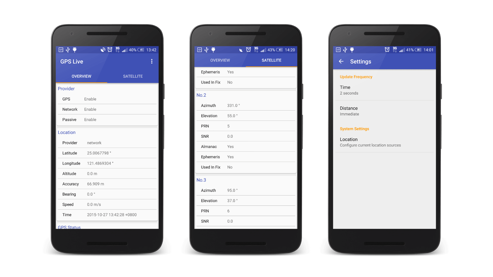

# GPS Live

GPS Live is a GPS monitor app with **Material Design**. It can show any GPS information you want to know.

The following are some main features:
- GPS provider state
- Location information such as: Latitude, Longitude, Altitude, etc.
- NMEA data
- Detailed satellite information
- Update frequency adjustment to save battery

## Screenshot

## License

    Copyright 2015 Samuel Huang

    Licensed under the Apache License, Version 2.0 (the "License");
    you may not use this file except in compliance with the License.
    You may obtain a copy of the License at

       http://www.apache.org/licenses/LICENSE-2.0

    Unless required by applicable law or agreed to in writing, software
    distributed under the License is distributed on an "AS IS" BASIS,
    WITHOUT WARRANTIES OR CONDITIONS OF ANY KIND, either express or implied.
    See the License for the specific language governing permissions and
    limitations under the License.